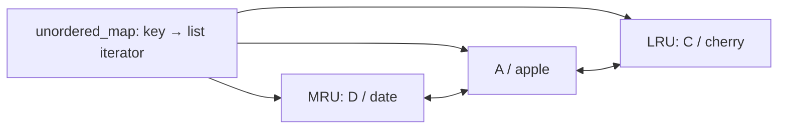

# Design and correctness

## Representation

A `std::list<std::pair<Key, Value>>` owns every entry. The map stores an iterator for each key. `std::list::splice` moves an existing node to the front without copying its value or invalidating its iterator. Rehashing the map does not move list nodes.

The STL list intentionally supplies the pointer management; the project focuses on composing structures with explicit ownership and invariants. A manually allocated linked list would add allocation and lifetime machinery without improving the algorithmic bound.

## Invariants and correctness argument

1. Each live key has exactly one list node and exactly one map entry pointing to that node.
2. Map size and list size agree after every completed operation.
3. List order represents decreasing recency of successful reads and writes.
4. Size never exceeds capacity after a successful operation.

A lookup miss changes only counters. A hit splices its node to the front, preserving the bijection and changing only that key's recency. A new insertion establishes a map/list pair at the front. If full, removing the back removes the least recent key by invariant 3. An update replaces the existing node at the front and repoints its map entry. Erasure removes both representations. Resizing repeatedly removes the back until the bound holds.

## Exception behavior

`put` accepts key and value by value and stages a new list node before modifying the existing entry. If argument construction or list allocation/value construction fails, the existing cache remains intact. If inserting a new key into the map fails, a catch block removes the staged list node and rethrows. Eviction occurs only after successful indexing, so allocation failure does not discard the previous LRU entry.

The guarantee assumes nonthrowing hash/equality functions and normal nonthrowing destructors. A throwing hash during eviction is outside the supported contract. The exception test forces the key copy into the map to throw at capacity and verifies the old entry survives. This is targeted fault injection, not exhaustive allocation-failure testing.

Updates invalidate pointers to the old value because they replace the node. Reads and unrelated promotions preserve list-node addresses. The returned `const Value*` prevents callers from modifying cached values without a corresponding recency update.

## Why disable cache copy and move?

Compiler-generated copying would copy iterators that still reference the source list. A correct copy must reconstruct the map against the copied nodes. Moving also requires a carefully documented moved-from state and consideration of custom hash/equality behavior. Both operations are explicitly deleted to keep the supported ownership contract small. Moving values into a cache remains supported.

## Concurrency

`SynchronizedCache` owns the base cache and a mutex. Each operation holds a `std::lock_guard` through lookup and result copying, so eviction cannot invalidate a result before the copy finishes. Individual calls are serialized; a sequence such as `get` then `put` is not a single atomic operation. Compound loader or get-or-compute behavior is outside the API.

The stress test issues concurrent puts, gets, erases, and resizes with values derived from keys. It verifies observed values, the final capacity bound, and the exact total number of reads. A stress pass alone is not proof of race freedom; an optional ThreadSanitizer build is provided for supported environments.

## Testing strategy

Assertions use an always-active check macro, so Release builds still validate behavior. Four deterministic seeds each generate 25,000 operations. An independent vector model compares full MRU order, values, capacity bounds, and statistics after every operation. Separate tests cover all-colliding hashes, rehashing, a capacity of one or zero, move-only ownership, and insertion rollback.

## Performance limits and extensions

Hash operations are expected O(1), not worst-case O(1). Long keys, costly value construction, hash collisions, allocation, and mutex contention all affect latency. Keys are stored twice, once in each structure. A list adds pointer and allocator overhead and has weaker locality than a vector.

Potential extensions include byte budgets, TTL with a separate expiration index, segmented LRU to resist scans, and sharded locking. These change policy or consistency guarantees and are intentionally left as future work, rather than claimed features.
